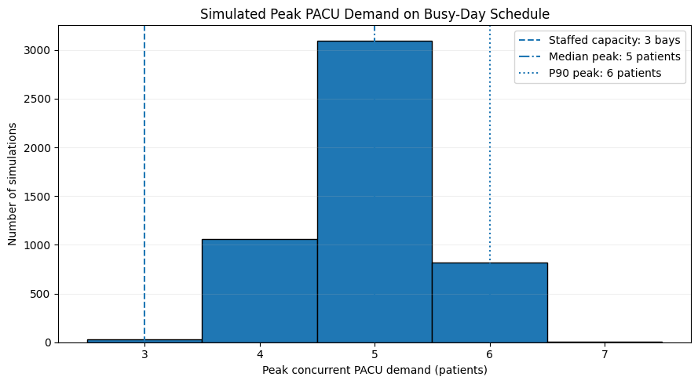
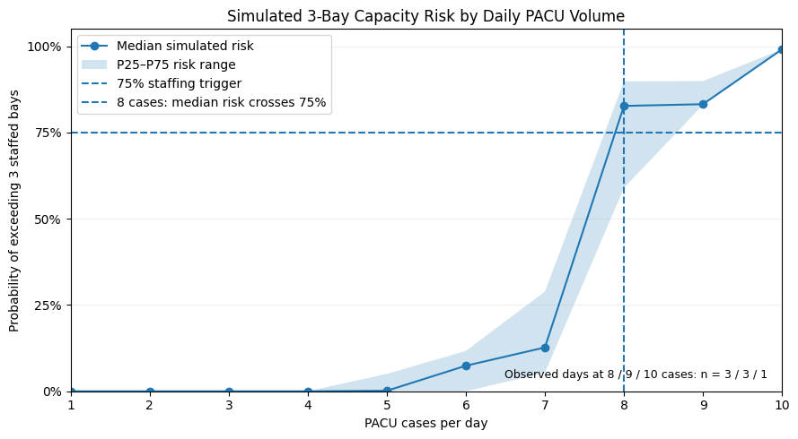
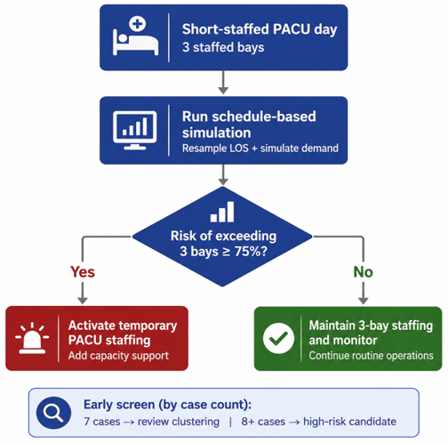

# PACU Staffing Risk Simulation

**Monte Carlo simulation for proactive PACU capacity planning and temporary staffing decisions**

## Business Problem

When PACU is short-staffed to **3 bays**, leaders need a practical way to decide whether temporary staffing should be activated before capacity pressure occurs.

A simple case count can provide an early warning, but schedules with the same number of cases can create very different levels of PACU demand depending on **arrival timing and recovery duration**.

This project uses historical PACU length-of-stay data and scheduled arrival patterns to estimate the probability that demand will exceed 3 staffed bays.

---

## Key Results

A high-volume observed schedule from **March 30, 2024**, with **10 PACU arrivals**, was used as the primary stress-test schedule.

| Metric                                  |         Result |
| --------------------------------------- | -------------: |
| Probability of exceeding 3 staffed bays |      **99.4%** |
| Expected time above capacity            |   **79.6 min** |
| Expected excess patient-minutes         |      **110.4** |
| Median simulated peak demand            | **5 patients** |
| P90 simulated peak demand               | **6 patients** |

### Staffing Recommendation

> **Activate temporary PACU staffing when the schedule-specific simulated probability of exceeding 3 staffed bays is ≥75%.**

For the stress-test schedule:

**99.4% simulated risk → Activate temporary staffing**

---

## Simulated Peak Demand



The simulation shows that capacity pressure is not just likely—it can also be substantial.

With 3 staffed bays:

* **Median peak demand:** 5 patients
* **P90 peak demand:** 6 patients

The typical simulated peak therefore exceeded staffed capacity by **2 patients**.

---

## Analytical Approach

The analysis uses the `or_encounter` table from a synthetic healthcare operations dataset.

### 1. Establish historical PACU demand

PACU length of stay was calculated from recorded PACU arrival and discharge timestamps.

Observed PACU LOS:

* **Median:** 97.0 minutes
* **P90:** 171.7 minutes

### 2. Select a stress-test schedule

Daily PACU volume was evaluated across the dataset.

The highest-volume observed day contained **10 PACU arrivals**, compared with a median of **3 arrivals per day**.

The actual PACU arrival times from this day were retained as the fixed schedule.

### 3. Simulate LOS uncertainty

For each Monte Carlo simulation:

1. Keep scheduled PACU arrival times fixed.
2. Resample PACU LOS from the historical distribution.
3. Calculate simulated discharge times.
4. Reconstruct concurrent PACU demand.
5. Measure peak occupancy and time above 3 staffed bays.

Repeating this process produces a distribution of possible capacity outcomes for the same schedule.

---

## Case Count as an Early Screen



Case volume can help leaders identify schedules that deserve additional review:

| PACU Cases   | Screening Action                    |
| ------------ | ----------------------------------- |
| **7 cases**  | Review arrival clustering           |
| **8+ cases** | High-risk candidate; run simulation |

Case count is **not the final staffing trigger** because arrival timing can materially change capacity risk.

The schedule-specific simulation provides the final decision signal.

---

## Operational Decision Rule



**Short-staffed 3-bay PACU**
↓
**Review schedule and run simulation**
↓
**Risk of exceeding 3 bays ≥75%?**

* **Yes → Activate temporary PACU staffing**
* **No → Maintain 3-bay staffing and monitor**

This creates a simple workflow: **case count provides the early warning; simulation determines the staffing decision.**

---

## Tools & Methods

**Tools**

* Python
* pandas
* NumPy
* Matplotlib
* Google BigQuery

**Methods**

* Timestamp-based occupancy reconstruction
* PACU length-of-stay analysis
* Monte Carlo resampling
* Capacity stress testing
* Probability-based decision thresholds

---

## Data

This project uses a **synthetic healthcare operations dataset** accessed through Google BigQuery.

Primary table:

`or_encounter`

Key fields include:

* `or_case_id`
* `or_pacu_arrival_dttm`
* `or_pacu_discharge_dttm`
* `or_case_type`

> **Data access note:** Raw course data are not redistributed in this repository. The notebook retains outputs so the analysis and results can be reviewed without access to the original BigQuery environment.

---

## Limitations

* Historical PACU LOS is assumed to reasonably represent future recovery times.
* LOS is resampled from the pooled historical distribution rather than predicted by patient or procedure.
* The model assumes PACU arrival timing is known for the scheduled day.
* The 3-bay threshold represents **staffed capacity**, not necessarily physical PACU capacity.

A production implementation could incorporate procedure-specific LOS estimates, real-time schedule changes, cancellations, staffing availability, and clinical acuity.

---

## Repository Contents

```text
pacu-staffing-risk-simulation/
│
├── README.md
├── pacu_staffing_risk_simulation.ipynb
├── pacu_staffing_executive_brief.pdf
├── requirements.txt
│
└── assets/
    ├── simulated_peak_demand.png
    ├── capacity_risk_by_volume.png
    └── staffing_decision_rule.png
```

* **Notebook:** full technical analysis and simulation workflow
* **Executive brief:** leadership-focused findings and staffing recommendation
* **Assets:** selected project visuals

